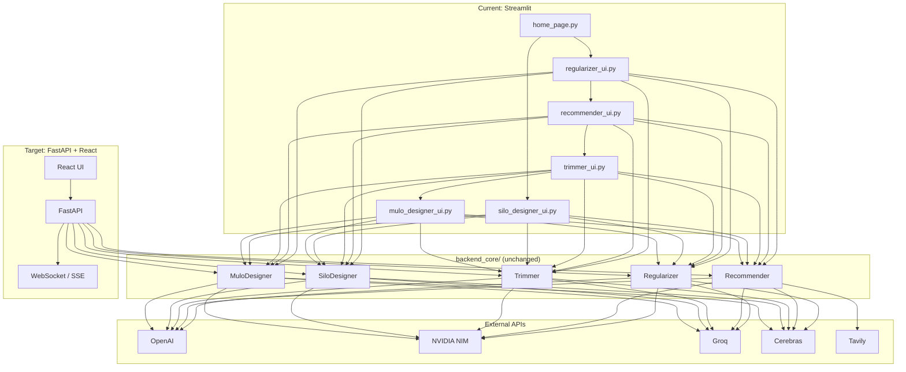

# LabCD Migration Report

> **Historical document.** The FastAPI + React stack now exists under `backend_api/` and `frontend/`.
> For how to run and where code lives, see [README.md](./README.md). Keep this file for migration context only.

**Streamlit → FastAPI + React**

| Field | Value |
|-------|-------|
| Project | LabCD (Lab Control Design) |
| Current stack | Streamlit + Python (`backend_core`) |
| Target stack | FastAPI + React |
| Migration status | **Not started** (0%) |
| Date | July 2026 |

---

## Executive Summary

LabCD is an AI-powered control-system design studio. Users upload MATLAB (`.m`) or Python (`.py`) dynamics files; the platform normalizes code, recommends controller architecture, finds equilibrium/trim points, and tunes PID controllers via LLM agents and genetic algorithms.

The project is in a **pre-migration state**. `AGENTS.md` defines the target architecture (FastAPI + React), but no API layer, React frontend, or multi-service Docker setup exists yet. The running application is entirely **Streamlit + Python**.

The strongest migration asset is `backend_core/` — five self-contained LangGraph modules with clear boundaries. The hardest work is replacing Streamlit's threading/queue/rerun pattern with API streaming and human-in-the-loop (HITL) pause/resume, plus building a React UI that preserves behavior without embedding business logic.

---

## 1. Current Architecture

### 1.1 Project Structure

```
LabCD-Phase-1-31/
├── backend_core/          # All business logic (no HTTP layer)
│   ├── Recommender/       # Multi-loop architecture recommendation
│   ├── Trimmer/           # Equilibrium/trim solving + linearization
│   ├── SiloDesigner/      # Single-loop SISO controller design
│   ├── MuloDesigner/      # Multi-loop cascade PID + GA
│   ├── Regularizer/       # MATLAB→Python, syntax fixing
│   └── inputs/            # Sample dynamics + generated reports
├── frontend_streamlit/    # Entire current UI (~65 files)
│   ├── home_page.py       # Main app entry
│   ├── *_ui.py            # Per-module UIs
│   ├── ga_agent_ui/       # Standalone GA-Agent app
│   └── inputs/            # Per-system sample JSON/PY files
├── case_studies/          # Reference systems (m/ + py/)
├── test_dynamics/         # Runtime temp files for custom dynamics
├── Test/                  # Pytest (Regularizer only)
├── assets/                # logo.svg
├── Dockerfile             # Single-container Streamlit
├── requirements.txt       # Python deps (uvicorn present, unused)
├── .env.example           # API keys
└── AGENTS.md              # Migration rules & goals
```

**Not present:** `README.md`, `docker-compose.yml`, FastAPI app, React frontend, `package.json`, database layer, ORM/migrations.

### 1.2 Business Pipelines

#### Shared Preprocessing — Regularizer

All pipelines start with uploaded `.m` or `.py` files:

| Step | Module | Purpose |
|------|--------|---------|
| Static analysis | `syntax_error_check.py` | AST-based equation validation |
| MATLAB translation | `MatlabToPython/matlab_to_numpy.py` | Rule-based + LLM-assisted `.m` → NumPy |
| Error fixing | `fix_syntax_error.py` | LLM repairs syntax/static errors |
| Standardization | `agents.py` | Normalizes Python to a consistent schema |

#### Pipeline A — Multi Loop Control Design (`muloDesign`)

```
Upload → Regularizer → Recommender → Trimmer → MuloDesigner (GA-Agent)
```

| Module | Role | Core technique |
|--------|------|----------------|
| **Recommender** | Parse dynamics, identify states/inputs, recommend cascaded PID architecture | LangGraph + LLM agents; optional RAG (web/image search for block diagrams) |
| **Trimmer** | Find operating-point equilibria (`x_e`, `u_e`), linearize, validate stability | LangGraph + scipy/numpy solver + LLM strategy planning |
| **MuloDesigner** | Batch controllers into cascade layers, estimate constraints, tune each loop | LLM constraint estimation + PyGAD genetic algorithm per loop |

Outputs: `controller.json`, block-diagram PNG, trim results, PDF reports, simulation plots.

#### Pipeline B — Single Loop Control Design (`siloDesign`)

```
Upload → Regularizer → SiloDesigner
```

| Component | Role |
|-----------|------|
| **SiloDesigner** | SISO controller design for one control loop |
| **LLM agents** | Actor (propose gains), Critic (explore/exploit), Juror (evaluate search), Terminator (stop condition) |
| **Simulation** | scipy `odeint` via `systems.py` / `simulation.py` |
| **Classic GA** | Optional PyGAD path in `classic/` |

Built-in systems: ball-beam, inverted pendulum, DC motor; also supports custom uploaded dynamics.

#### Standalone GA-Agent UI

`frontend_streamlit/ga_agent_ui/` is a separate Streamlit app for LLM-enhanced GA PID design using JSON case studies (CSTR, AUV, BallBeam, etc.).

### 1.3 UI Flow

Navigation is **Streamlit session state**, not URL routing.

```
home_page.py
    │
    ├── Upload + LLM model select
    │
    ├── Single Loop (siloDesign) ──► SiloDesigner UI
    │
    └── Multi Loop (muloDesign)
            ├── Recommender UI
            ├── Trimmer UI
            └── MuloDesigner / GA-Agent UI
```

**Global session keys:**
- `global_step`: `"upload"` → `"recommender"` → `"trimmer"` → `"siloDesign"`
- `selected_pipeline`: `"muloDesign"` | `"siloDesign"`
- `stage`, `model`, `uploaded_file`, `file_content`, `human_intervention`

**Per-module step keys:**

| Module | Session key | Steps |
|--------|-------------|-------|
| Regularizer | `stage` | `upload` → `processing` → (optional human edit) |
| Recommender | `recommender_step` | `upload` → `initial_run` → `review` → `rag_run` → `comparison` |
| Trimmer | `trimmer_step` | `upload` → `operating_conditions` → `processing` → `human_input` → `review` |
| SiloDesigner | various | settings, objective, GA run, live plots |
| MuloDesigner | `mulo_designer_stage` | `setup` → `edit_case_study` → `run_designer` → `project_page` → `optimisation_complete` |

**UI ↔ backend integration pattern:**

Streamlit UIs run LangGraph workflows on background threads and poll a `queue.Queue`. The main loop consumes events and calls `st.rerun()` for live progress. This pattern appears in Recommender, Trimmer, SiloDesigner, and MuloDesigner.

### 1.4 Session Management

There is **no authentication** (no JWT, OAuth, or login).

| Layer | Mechanism | Persistence |
|-------|-----------|-------------|
| **Streamlit** | `st.session_state` | In-memory per browser tab; lost on refresh |
| **LangGraph (Recommender)** | `MemorySaver` checkpointer | In-process only; `thread_id: "1"` hardcoded |
| **LangGraph (Trimmer, SiloDesigner, MuloDesigner)** | No checkpointer | State lives only during `graph.stream()` |
| **Filesystem** | Explicit writes to `results/`, `backend_core/logs/`, `.logs/` | Survives restarts |
| **DummySessionManager** | SiloDesigner stub | Returns empty history; writes temp files to `test_dynamics/` |

**Human-in-the-loop (HITL):**
- **Recommender:** LangGraph `MemorySaver` checkpoint; user chooses RAG strategy (Tavily block-diagram search vs OpenAI web search)
- **Trimmer:** `HumanInputRequired` exception pauses the worker thread; UI renders a form and injects answers into `state["ui_inputs"]`
- **Regularizer:** User can edit fixed code before proceeding

### 1.5 AI Components

#### Orchestration

| Library | Version | Usage |
|---------|---------|-------|
| **LangGraph** | 0.6.7 | Workflow graphs in all five backend modules |
| **LangChain** | 0.3.x | Prompt templates, provider adapters, message handling |
| **OpenAI SDK** | 2.36.0 | Chat + Responses API with `web_search_preview` tool |

#### LLM Providers

| Provider | Env var | Primary use |
|----------|---------|-------------|
| OpenAI | `OPENAI_API_KEY` | Thinking models, web search, image recognition, SiloDesigner agents |
| NVIDIA NIM | `NVIDIA_API_KEY` | Nemotron, gpt-oss-120b for standardization and analysis |
| Groq | `GROQ_API_KEY` | Fast inference for Trimmer thinking model |
| Cerebras | `CEREBRAS_API_KEY` | SiloDesigner Actor/Critic/Juror/Terminator |
| Tavily | `TAVILY_API_KEY` | Web search for control block-diagram images |

UI model selector: `gpt-5.5`, `gpt-5.4`, `gpt-5.4-mini`, `gpt-4o`, `gpt-4o-mini`.

#### Agent Architectures

**Recommender** (`agents/agents.py`):
- `system_analyser` → `control_loop_analyser` → `control_loop_supervisor` → `create_controller_graph`
- Optional RAG: Tavily image search → OpenAI image recognition, or OpenAI web search

**Trimmer** (`agenticNodes/`):
- `parse_system` → `plan_strategy` → `solve_equilibrium` → `analyze_result` → `generate_output`
- Conditional retry loops for convergence failure and equilibrium mismatch

**SiloDesigner** (`src/llm_agents.py`):
- Multi-agent loop: Actor → Critic → Juror → Terminator

**MuloDesigner / GaAgent** (`GaAgent/src/graph.py`):
- LLM proposes GA hyperparameters → PyGAD runs optimization → LLM evaluates results → iterate

**Regularizer** (`agents.py`):
- `fix_syntax_error`, `fix_whole_code`, `standardize_python_file`

#### Non-LLM Numerical Methods

- **scipy** — equilibrium solving, `odeint` simulation, linearization
- **numpy** — state-space math
- **pygad** — genetic algorithm optimization
- **matplotlib / plotly** — visualization
- **reportlab** — PDF trim reports

**Note:** No vector embeddings or vector DB. "RAG" means web search + image recognition for control-architecture references.

### 1.6 Database

**No database exists.** No SQLAlchemy, Alembic, SQLite, Postgres, Redis, or MongoDB in application code.

Data persistence is filesystem-only:

| Location | Content |
|----------|---------|
| `results/` | Controller graph PNGs, trim JSON |
| `backend_core/logs/` | Trimmer session logs |
| `backend_core/results/` | Trimmer output JSON/PDF/PNG |
| `.logs/` | SiloDesigner scenario history JSON |
| `test_dynamics/` | Temp custom dynamics from uploads |
| `frontend_streamlit/inputs/` | Sample per-system configs |
| `case_studies/` | Reference dynamics |
| `ga_agent_ui/case_studies/json/` | GA case study configs |

State schemas are TypedDict (not ORM):
- `Recommender/states.py` — `OverallState`
- `Trimmer/states.py` — `WorkflowState`
- `MuloDesigner/GaAgent/src/graph.py` — `GAConfigState`
- SiloDesigner — inline dict state in `controllers.py`

### 1.7 External Services

| Service | Integration point | Purpose |
|---------|-------------------|---------|
| **OpenAI API** | Recommender, SiloDesigner, GaAgent | Chat completions, Responses API + `web_search_preview`, structured JSON |
| **NVIDIA AI Endpoints** | Recommender, Trimmer, Regularizer | Nemotron, gpt-oss-120b via NIM |
| **Groq** | Trimmer, Recommender fallback | Fast LLM inference |
| **Cerebras** | SiloDesigner | LLM agents for controller design |
| **Tavily** | Recommender RAG | Image web search for block diagrams |
| **LangSmith** | Dependency only | No explicit tracing config found |

#### Deployment

- **Dockerfile:** Python 3.11-slim + graphviz, Streamlit on port 8501
- **CI/CD:** GitHub Actions on push to `master` — SCP to server, Docker build + run
- **API keys:** Injected as container env vars

**Known issue:** Dockerfile CMD references `home_page.py` at repo root, but the file lives at `frontend_streamlit/home_page.py`.

---

## 2. Target Architecture

Per `AGENTS.md`:

| Aspect | Current | Target |
|--------|---------|--------|
| Frontend | Streamlit (monolithic Python UI) | React (presentation only) |
| API | Direct Python imports | FastAPI REST/WebSocket |
| State | `st.session_state` + in-memory queues | Server-side sessions or DB-backed state |
| Auth | None | TBD |
| Deployment | Single Docker container (Streamlit) | Dockerized multi-service (API + frontend) |
| Business logic | `backend_core/` | `backend_core/` unchanged |
| Tests | Regularizer unit tests only | Integration + API tests |

### Design Principles (from AGENTS.md)

- Keep code simple; never overengineer
- Never write business logic inside React
- Never duplicate code
- One responsibility per function
- Use Docker and environment variables
- Preserve original behavior

---

## 3. Migration Assessment

### 3.1 Strengths

1. **Business logic is already separated** in `backend_core/` — five self-contained modules with clear boundaries.
2. **LangGraph workflows are UI-agnostic** — graphs accept state dicts and stream events; only the HITL interrupt mechanism is Streamlit-specific.
3. **Prompt templates are YAML files** — portable across any frontend.
4. **State schemas are TypedDict** — map cleanly to Pydantic models for FastAPI.
5. **No database to migrate** — greenfield choice for session/project persistence.
6. **Docker already in use** — foundation for multi-container setup.

### 3.2 Risks

| Risk | Severity | Detail |
|------|----------|--------|
| **Streamlit threading model** | High | Background threads + `queue.Queue` + `st.rerun()` must become WebSockets/SSE + async FastAPI |
| **Human-in-the-loop** | High | Trimmer's `HumanInputRequired` exception pattern and Recommender's `MemorySaver` interrupts need API pause/resume endpoints |
| **Long-running workflows** | High | GA optimization and LangGraph runs can take minutes; need job queue (Celery/Redis) or streaming |
| **File uploads** | Medium | Dynamics files, generated PNGs/PDFs need multipart API + object storage |
| **Session persistence** | Medium | All state lost on refresh today; migration is a chance to add real persistence |
| **Multiple entry points** | Medium | `home_page.py`, `ga_agent_ui.py`, `mulo_designer_ui.py` are separate Streamlit apps — need unified React routing |
| **Dockerfile path bug** | Low | Fix before or during migration |
| **Test coverage** | Medium | Only Regularizer tested; no safety net for behavior preservation |
| **LLM API key management** | Low | Currently server-side env vars; keep same pattern in FastAPI |

### 3.3 Module Migration Complexity

| Module | Complexity | Reason |
|--------|------------|--------|
| Regularizer | Low | Synchronous, no HITL, no streaming |
| Recommender | High | LangGraph checkpoint, RAG HITL, streaming, image handling |
| Trimmer | High | HITL via exception, PDF generation, multi-step conditional graph |
| SiloDesigner | Medium | Long-running GA loop, progress monitoring, plot data |
| MuloDesigner | High | Cascade GA, callback registry, case study JSON editing |
| Streamlit UI → React | High | 65 files, custom CSS, threaded queue patterns throughout |

---

## 4. Recommended Migration Phases

### Phase 0 — Foundation (no UI change)

- [ ] Fix Dockerfile CMD path (`frontend_streamlit/home_page.py`)
- [ ] Add `README.md` with architecture docs
- [ ] Expand test coverage for `backend_core` modules
- [ ] Extract shared Pydantic schemas from TypedDict state definitions
- [ ] Add `docker-compose.yml` scaffold

### Phase 1 — FastAPI Shell

- [ ] Create `backend_api/` with FastAPI app
- [ ] Health check, file upload, model selection endpoints
- [ ] Wrap Regularizer as first API route (simplest, no HITL)
- [ ] Keep Streamlit running in parallel for validation

### Phase 2 — Workflow APIs

- [ ] Expose each LangGraph module as API endpoints with SSE/WebSocket streaming
- [ ] Replace `HumanInputRequired` with LangGraph `interrupt()` + API resume
- [ ] Add job ID + server-side state store (Redis or SQLite)
- [ ] Artifact download endpoints (JSON, PDF, PNG)

### Phase 3 — React Frontend

- [ ] Pipeline selection page (mirrors `home_page.py`)
- [ ] Upload + model selector component
- [ ] Per-module views with real-time progress (WebSocket consumer)
- [ ] HITL forms for Trimmer and Recommender RAG decisions
- [ ] Plot/chart components (plotly.js or recharts)
- [ ] No business logic in React — only API calls and rendering

### Phase 4 — Persistence & Production

- [ ] Project/session database (user uploads, workflow state, results)
- [ ] Authentication (if required)
- [ ] `docker-compose.yml`: FastAPI + React (nginx) + Redis
- [ ] CI/CD update: build both images, deploy multi-container
- [ ] Retire Streamlit frontend

---

## 5. Proposed API Surface

```
POST   /api/v1/upload                        # Upload dynamics file
POST   /api/v1/regularize                    # Run Regularizer
POST   /api/v1/recommender/start             # Start Recommender graph
GET    /api/v1/recommender/{id}/stream       # SSE progress
POST   /api/v1/recommender/{id}/rag-decision # HITL RAG choice
POST   /api/v1/trimmer/start
GET    /api/v1/trimmer/{id}/stream
POST   /api/v1/trimmer/{id}/input            # HITL form submission
POST   /api/v1/silo/start
GET    /api/v1/silo/{id}/stream
POST   /api/v1/mulo/start
GET    /api/v1/mulo/{id}/stream
GET    /api/v1/jobs/{id}/results             # Download JSON/PDF/PNG artifacts
GET    /api/v1/case-studies                  # List reference systems
GET    /api/v1/health
```

---

## 6. Behavior Preservation Checklist

Per `AGENTS.md` ("Preserve original behavior"), verify after migration:

- [ ] MATLAB → Python translation produces equivalent dynamics
- [ ] Recommender outputs same controller JSON structure
- [ ] Trimmer finds same equilibria for case studies
- [ ] SiloDesigner GA/LLM loop converges on built-in systems
- [ ] MuloDesigner cascade GA produces comparable PID gains
- [ ] RAG block-diagram search still functional
- [ ] PDF report generation intact
- [ ] All 20+ case studies pass end-to-end

---

## 7. Key File Index

| Area | Path |
|------|------|
| App entry | `frontend_streamlit/home_page.py` |
| Recommender graph | `backend_core/Recommender/build_graph.py` |
| Trimmer graph | `backend_core/Trimmer/build_graph.py` |
| SiloDesigner graph | `backend_core/SiloDesigner/src/controllers.py` |
| GaAgent graph | `backend_core/MuloDesigner/GaAgent/src/graph.py` |
| LLM agent factory (Trimmer) | `backend_core/Trimmer/agenticNodes/create_agent.py` |
| Multi-provider LLM base | `backend_core/SiloDesigner/src/llm_agents.py` |
| HITL service | `backend_core/Trimmer/services/human_input.py` |
| Prompt templates | Under `backend_core/*/templates/` and `backend_core/*/agents/` |
| Env config | `.env.example` |
| Dependencies | `requirements.txt` |
| Migration rules | `AGENTS.md` |
| Deployment | `Dockerfile`, `.github/workflows/deploy.yml` |

---

## 8. Architecture Diagram



---

## 9. Conclusion

LabCD has a **mature, well-separated backend** ready for API extraction, but the **entire frontend is Streamlit-coupled** through direct imports, background threads, and session state. The migration is feasible in four phases, starting with the simplest module (Regularizer) and progressively tackling HITL and streaming complexity. The highest-risk items are the threading model replacement and behavior preservation across 20+ case studies with minimal test coverage today.
